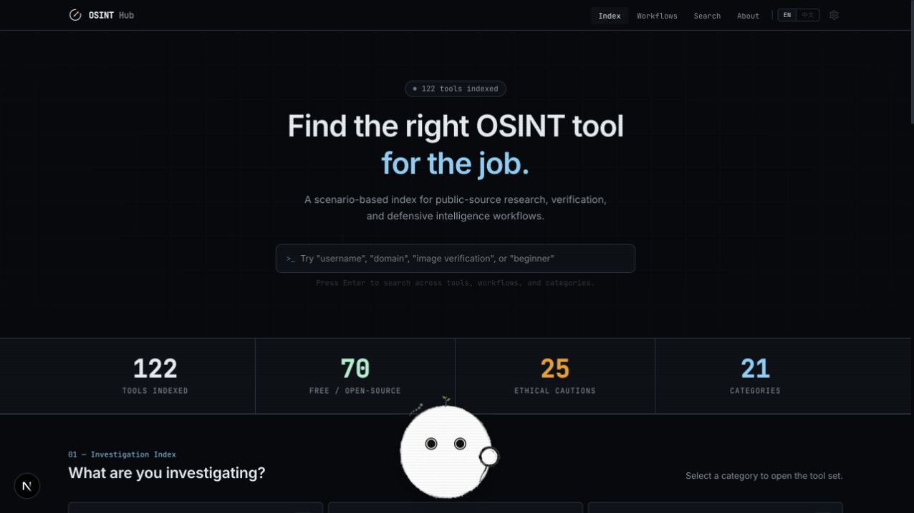

# OSINT Hub mascot acceptance · 2026-10-03

## Delivery

- Renderer mounted once in the Next.js root layout.
- Four modules: `senses.ts` observes events; `drives.ts` handles decay and saved data; `selection.ts` chooses drive-weighted actions; `player.ts` owns priority transitions, tap decoding and recovery.
- One 100ms scheduler, 1s drive heartbeat, 40/30/20/10 wheel with ±20% duration drift and repetition suppression. Shared baseline first action 4.5s / idle gaps 1.4–2.8s. No contemplation deviation.
- Configurable core, slot anchors, state durations, movement bounds, priorities, drives and persistence in `mascot.config.ts`.
- `mascot.behaviors.json` and `mascot-skin-behaviors.md`: 17 skins / 33 slots. Only OSINT is installed here; remaining rows are a declarative catalog.

## Explicit requirements checked

| Requirement | Result |
|---|---|
| Original core, double eyes, unique green sprout | Core PNG files byte-identical to asset library; sprout opacity 1 confirmed in preview |
| Light/dark baked assets; no recoloring | Both theme asset paths loaded in browser |
| Face unobstructed | Magnifier moved to outer lower-right; desktop companion screenshot checked |
| Pure action; no bubble or tool panel | Renderer contains no visible instructions or popup panel |
| Hover 560ms / click reaction + hop | Shared config and temporal tests; single wake confirmed in browser |
| Double startle / triple blush-hide-return | Temporal test passes; both slots use recoil animation |
| Half-eye rest / random bottom travel | Desktop and 375px mobile preview; clamped 16–84% travel |
| Focus and modal guards | Search focus and settings panel both produced guarded state; closing restored rest |
| Reduced motion, sleep/wake, memory | Engine assertions pass; CSS disables motion. OS-level reduced-motion visual testing not performed |
| Inner drives and interruptions | Low-energy weighting, persisted value clamp, input freeze, priority tests pass |
| OSINT-specific working actions | Lens scan + trail reveal on click; rare idle trace-follow scan |

## Verification commands

- `node scripts/verify-mascot.cjs`: 9 passing checks.
- `npx --no-install tsc --noEmit`: pass.
- `npm run build`: pass, static export succeeds. Native image lint advisories remain for the small layered PNG renderer.
- Asset library manifests declare four-color penetration pass. Installed runtime PNG corners have alpha 0 and core copies retain original bytes. No regenerated or recolored assets.
- Browser preview: desktop dark, mobile light at 375×812, full reveal, input guard, panel guard. Landscape capture was inconclusive during viewport resizing; it is not marked visually accepted.
- User supplied sections 1–4; referenced sections 5–12 were absent. This report checks the supplied explicit contract rather than inventing missing checklist items.

## Reference mechanisms

Reviewed [Oneko source](https://raw.githubusercontent.com/adryd325/oneko.js/main/oneko.js) for gated update / idle progression and [VS Code Pets states](https://raw.githubusercontent.com/tonybaloney/vscode-pets/main/src/panel/states.ts) for explicit state transitions. Adapted the existing PostSoma engine; did not copy sprites, speech bubbles, or GPL code.

## Preview

Local: http://127.0.0.1:3181/

